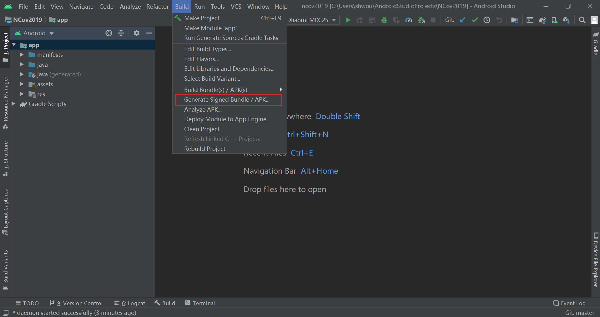
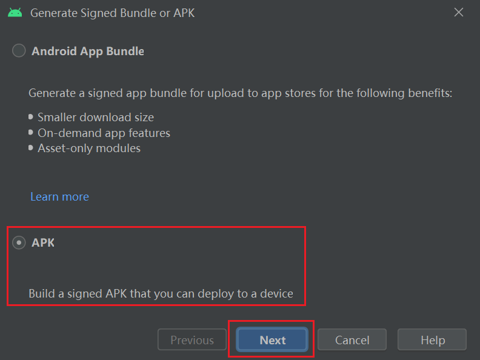
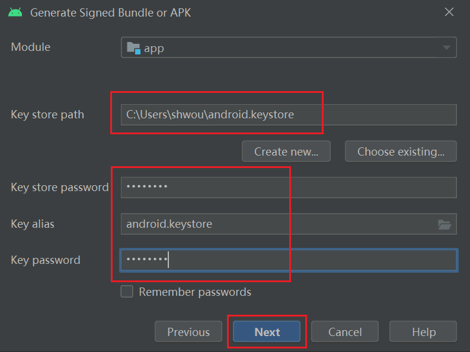
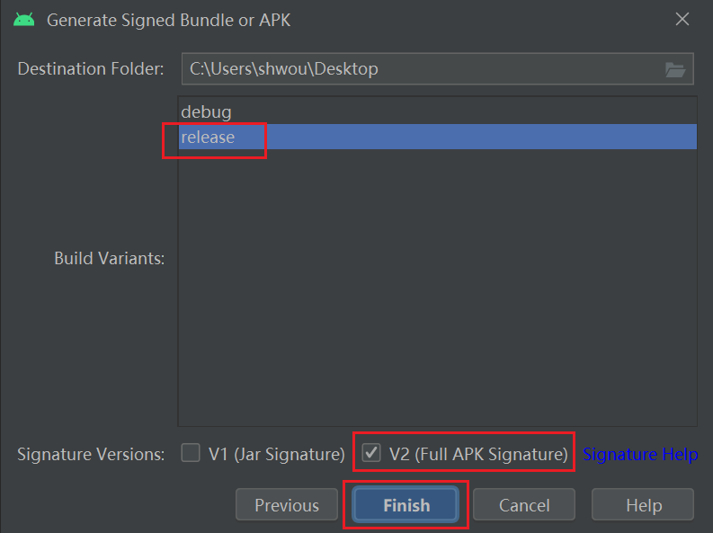

# NCov2019

## How to build an apk file for Android system

1. First we need to choose "Generate Signed Bundle / APK" from the toolbar in Android Studio.

2. Then we choose to generate APK.

3. Next, we need to specify the key generated by ourselvse. If there is no key available, generate one by the following command.
`
keytool -genkey -alias "key's alias" -validity "time to expire" -keystore "key's file name"
`.
We need to specify the destination path of the key, the password for the key store, key's alias and the password for the key. These are all set up when generating the key.

4. Finally, we choose the release variants and select V2 full APK signature.
5. We can find the apk-release file in the destination assigned before!